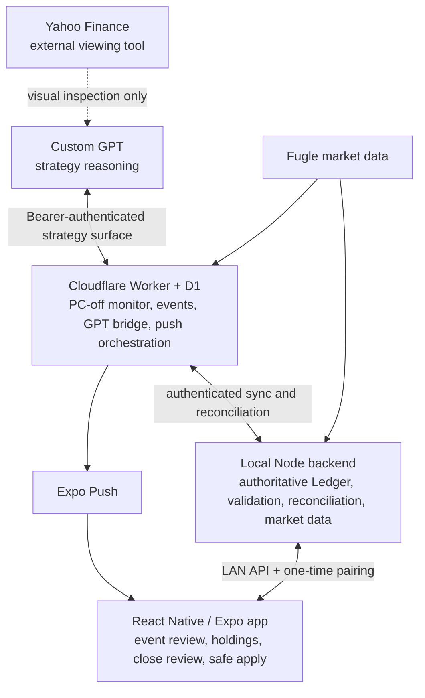

# Eason Trading

Eason Trading is a personal decision-support system for a workflow that already uses GPT for strategy reasoning and Yahoo Finance for visual market inspection. It fills the missing layer between them: persistent strategy memory, deterministic monitoring, exact event handoff, and safe local/cloud synchronization.

**GPT reasons about strategy. The local backend owns authoritative trading truth. Cloudflare provides PC-off monitoring and event delivery. A shared deterministic trigger engine turns strategy into executable rules while preventing AI from changing cash, executed trades, or holding quantities.**

> **Current release target:** v0.3.19. The immutable prior production tag [`v0.3.18-final-r3`](https://github.com/eason11133/eason-trading/tree/v0.3.18-final-r3) remains the rollback baseline.

## PC-off mobile Ledger writes

Normal mobile Ledger actions do not require the PC to remain online. Add/edit/remove holding, cash correction, and executed buy/sell records are authenticated and durably appended to a Cloud queue. The phone reports **已提交，待同步**—never “completed”—until the local backend reconnects, validates the mutation, applies it exactly once, and acknowledges `applied` or `rejected`.

Cloud is transport, not a portfolio database: queued payloads and lifecycle status are non-authoritative. Cash, positions, trades, and all final Ledger truth remain in the local state. A durable local applied-mutation index prevents replay after crashes or lost acknowledgements; position/cash preconditions reject stale corrections instead of guessing. GPT uses a separate strategy-only API and has no route or credential that can enqueue Ledger mutations.

## Why I built this

My original workflow was fragmented: I discussed strategy with GPT, inspected charts in Yahoo Finance, copied screenshots and numbers between tools, and had no reliable place for a strategy to remain active after the conversation ended. A useful reassessment could also be lost unless I happened to be watching the market at the right moment.

Eason Trading intentionally does **not** replace Yahoo Finance. Yahoo remains the viewing tool; GPT remains the reasoning tool. Eason Trading remembers the plan, monitors structured conditions, freezes the evidence when something meaningful happens, and synchronizes the resulting strategy safely.

## Core workflow

### During market hours

```text
GPT strategy
    → structured review trigger
    → shared deterministic rule engine
    → local and PC-off cloud monitoring
    → meaningful state transition
    → frozen event snapshot + Expo push
    → GPT reassessment of that exact event
```

Notifications are not raw price-touch alerts. A rule can combine price, RVOL, VWAP, daily high/low, and percentage change; require consecutive qualifying ticks; enforce cooldown or one-shot behavior; reject stale strategy versions; and give invalidation precedence over an old entry thesis.

### After market close

```text
daily close package
    → GPT review
    → strategy-only response
    → validated diff/apply or no-change
    → next-session monitor synchronization
```

The close package carries tracked market/setup/trigger context but deliberately omits cash amounts and executed-trade history from the GPT bridge. See [Architecture](docs/ARCHITECTURE.md#after-close-package) and the implementation in [`server/src/cloud-monitor.mjs`](server/src/cloud-monitor.mjs).

## System architecture



D1 holds reconstructable monitoring, event, device, and GPT-command state. It is not a second trading Ledger. The complete component and data-ownership model is documented in [`docs/ARCHITECTURE.md`](docs/ARCHITECTURE.md).

## Engineering highlights

- **Hybrid local/cloud authority:** private trade truth stays local while Cloudflare can monitor when the PC is off. [Architecture](docs/ARCHITECTURE.md#data-ownership)
- **Deterministic smart triggers:** one shared state machine implements qualification, invalidation, persistence, cooldown, one-shot, re-entry, and version checks. [`shared/smart-trigger.mjs`](shared/smart-trigger.mjs)
- **Local/cloud semantic parity:** the Worker imports the same trigger engine, with explicit parity tests. [`cloudflare/src/worker.test.mjs`](cloudflare/src/worker.test.mjs)
- **AI authority boundary:** GPT tools expose strategy writes but no cash, trade, or quantity operation; the local validator rejects Ledger-shaped keys. [`server/src/store.mjs`](server/src/store.mjs), [`cloudflare/src/worker.mjs`](cloudflare/src/worker.mjs)
- **Exact event correlation:** a trigger freezes its market/context snapshot and carries the same event identity through push, GPT handoff, no-change/apply, and completion. [`server/src/review-triggers.mjs`](server/src/review-triggers.mjs)
- **Idempotent reconciliation:** duplicate strategy payloads are detected, status only advances, retries are safe, and completed events are retried to Cloud. [`server/src/gpt-update.test.mjs`](server/src/gpt-update.test.mjs)
- **Release safety:** clean-package checks, isolated test state, installer/rollback contracts, PowerShell interoperability checks, and production audit gates protect the installed baseline. [`scripts/verify-release.mjs`](scripts/verify-release.mjs)
- **Mobile integration:** Expo/React Native UI, native SVG charts, SecureStore pairing, push response routing, and EAS-compatible Android configuration. [`mobile/`](mobile/)

For a problem/decision/implementation/evidence view, see [`docs/TECHNICAL_HIGHLIGHTS.md`](docs/TECHNICAL_HIGHLIGHTS.md).

## Safety boundary

| GPT may change | GPT must never change |
| --- | --- |
| Strategy and priority | Cash |
| Setup stage and rationale | Executed BUY/SELL records |
| Playbook levels | Authoritative holding quantity |
| Review-trigger conditions and policy | Ledger truth |
| Non-Ledger review state | Any representation of an executed order |

This is enforced at three layers: the remote Action/OpenAPI schema exposes strategy-only operations; Cloud rejects forbidden strategy keys; and the local backend converts a command through the same validated update path before acknowledging it as `APPLIED`. The read replica includes limited position context for reasoning but identifies itself as non-authoritative and excludes cash amounts and executed-trade history.

The reason is architectural, not prompt-based: an AI analysis can be wrong or incomplete, but it must never become a fabricated financial transaction. Evidence is summarized in [`docs/TESTING_AND_SAFETY.md`](docs/TESTING_AND_SAFETY.md).

## Validation

The FINAL-R3 source verifier currently reports:

- **Backend:** 91/91 tests
- **Cloud Worker:** 24/24 tests
- **Shared smart-trigger engine:** 8/8 focused state-machine tests
- **Expo Doctor:** 21/21 checks in the release/runtime validation environment
- **TypeScript:** real `tsc --noEmit` gate after dependency installation
- **Mobile bundles:** Android and iOS Expo/Hermes export smoke gates in the release workflow

The repository verifier uses an isolated temporary `state.json`; it does not load the user's Ledger. The separate production audit checks authenticated local/cloud health, command-safe sync, a non-mutating GPT bridge `PING`, Expo push-ticket success, and an unchanged Ledger fingerprint. It requires explicit audit mode so unrelated pending strategy commands are held. See [`docs/TESTING_AND_SAFETY.md`](docs/TESTING_AND_SAFETY.md) and [`scripts/audit-production.ps1`](scripts/audit-production.ps1).

## Repository map

| Path | Evidence to inspect |
| --- | --- |
| [`mobile/`](mobile/) | React Native app, event-driven UI, pairing, push routing, SVG charts |
| [`server/src/`](server/src/) | Authoritative local state, Ledger operations, strategy validation, reconciliation |
| [`cloudflare/`](cloudflare/) | Worker, D1 migrations, PC-off monitor, GPT Action/OpenAPI, Expo Push |
| [`shared/smart-trigger.mjs`](shared/smart-trigger.mjs) | Deterministic rule and runtime-state implementation used locally and in Cloud |
| [`scripts/`](scripts/) | Release verification, production audit, deployment and rollback safeguards |
| [`docs/ARCHITECTURE.md`](docs/ARCHITECTURE.md) | Components, ownership, event lifecycle, synchronization, failure behavior |
| [`docs/ENGINEERING_STORY.md`](docs/ENGINEERING_STORY.md) | How the design changed and what I learned |

## Tech stack

- JavaScript, TypeScript, and Node.js
- React Native and Expo (Android/iOS)
- Cloudflare Workers and D1
- Fugle market-data APIs
- Expo Push Notifications and EAS
- Custom GPT Actions / OpenAPI and remote MCP-compatible tools
- PowerShell release and production-audit tooling on Windows

## Status and external configuration

**v0.3.18 FINAL-R3 is the production source baseline.** Source-side support for the GPT Action, Cloud Worker, local backend, mobile app, and safety gates is present here. Attaching the Action to a particular Custom GPT and supplying account secrets are account-side operations and are intentionally not source-controlled. Real `.env` files, `google-services.json`, Cloudflare secrets, runtime state, Ledger data, keystores, and APKs are excluded from Git.

Start with [`START_HERE.md`](START_HERE.md) for operation, [`docs/ARCHITECTURE.md`](docs/ARCHITECTURE.md) for design, and [`docs/TECHNICAL_HIGHLIGHTS.md`](docs/TECHNICAL_HIGHLIGHTS.md) for a short technical review.
