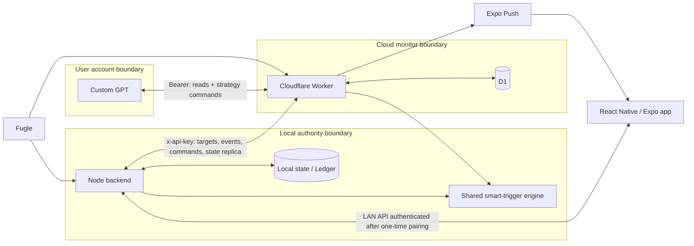
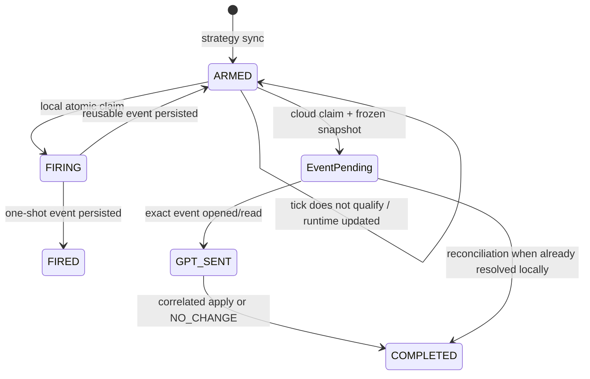

# Architecture

## Architecture goals

Eason Trading is designed around six constraints:

1. The local Ledger remains the single source of truth for cash, executed trades, and holding quantities.
2. Monitoring should continue when the user's PC is off.
3. GPT may reason about and update strategy, but it must not create trading truth.
4. Local and cloud monitoring must interpret a rule with the same semantics.
5. A reassessment must preserve the exact event and market context that caused it.
6. Distributed sync and reconciliation must tolerate retries without duplicating effects or moving state backward.

## System view

The Worker imports [`shared/smart-trigger.mjs`](../shared/smart-trigger.mjs), the same implementation used by the local backend. Yahoo Finance is outside this diagram because it is a separate viewing tool, not a system dependency.

## Components

### Mobile App

**Responsibility:** presents holdings and strategy context, routes a notification to the matching event review, starts after-close handoffs, previews/applies strategy updates, and records user-authorized Ledger operations through the backend.

**Owns locally:** the paired backend URL and API key in SecureStore, UI state, and cached chart data.

**Does not own:** authoritative cash, trades, holdings, cloud monitor state, or GPT command state.

**Boundary:** the phone receives the local API key only through a short-lived, one-time six-digit pairing flow. See [`mobile/src/connection.ts`](../mobile/src/connection.ts), [`mobile/src/push.ts`](../mobile/src/push.ts), and [`server/src/pairing.mjs`](../server/src/pairing.mjs).

### Local Backend

**Responsibility:** owns and persists Ledger truth, obtains local market data, validates every strategy update, evaluates local triggers, generates close packages, and reconciles with Cloud.

**Owns:** cash, executed trades, authoritative position quantities and cost basis, strategy/setup/playbook state, local review inbox, and local audit history.

**Does not delegate:** no Cloud or GPT acknowledgement can directly mutate Ledger fields. The backend is the only component that can turn an allowed command into a local strategy-state change.

**Boundary:** protected local routes fail closed unless the configured `TRADING_API_KEY` is at least 20 characters and exactly matches the request header. See [`server/src/auth.mjs`](../server/src/auth.mjs), [`server/src/store.mjs`](../server/src/store.mjs), and [`server/src/server.mjs`](../server/src/server.mjs).

### Shared Smart Trigger Engine

**Responsibility:** normalizes rule fields/operators and makes a deterministic decision from a trigger, market snapshot, strategy context, policy, and persisted runtime state.

**Owns:** no durable data itself. It returns evidence and the next runtime state; the caller persists that state locally or in D1.

**Does not own:** market retrieval, notification delivery, event storage, or strategy authority.

**Boundary:** only six numeric fields and five comparison operators are accepted. See [`shared/smart-trigger.mjs`](../shared/smart-trigger.mjs).

### Cloudflare Worker

**Responsibility:** evaluates synced monitor targets during the Taipei market window, freezes monitor events, retries push delivery, stores the latest GPT read replica, exposes the strategy-only GPT Action/MCP surface, and queues commands for local validation.

**Owns:** D1 rows for monitor targets, monitor events, registered devices, GPT bridge snapshots, and strategy-command queue status.

**Does not own:** authoritative cash, executed trades, or holding quantity. Monitor data is reconstructable from local strategy; GPT state is explicitly a read-only, non-authoritative replica.

**Boundary:** privileged monitor/backend routes use `x-api-key`; GPT Action/MCP routes use a distinct bearer token. See [`cloudflare/src/worker.mjs`](../cloudflare/src/worker.mjs).

### D1

**Responsibility:** durable storage while the PC is unavailable.

**Stores:** `monitor_targets`, `monitor_events`, `devices`, `meta`, `gpt_bridge_state`, and `gpt_strategy_commands`, as defined in [`cloudflare/migrations/`](../cloudflare/migrations/).

**Does not store:** the authoritative local Ledger. Target context is deliberately limited to the strategy and monitoring data needed for a decision.

### GPT Action / OpenAPI surface

**Responsibility:** lets the Custom GPT read sanitized state, a stock strategy, the active handoff, an exact review event, or the close package; it may queue a strategy update or strategy-only undo and inspect command status.

**Owns:** no source of truth. It is a controlled interface to D1-backed replicas and a command queue.

**Does not expose:** any endpoint for recording a trade, changing cash, editing authoritative position quantity, or initializing the Ledger.

The generated schema is implemented in [`cloudflare/src/worker.mjs`](../cloudflare/src/worker.mjs). Attaching that schema to a Custom GPT is an account-side setting and is not stored in this repository.

### Market data

Fugle supplies the local backend and PC-off Worker with market data. The Worker rejects stale or exchange-holiday quotes before evaluating targets. RVOL is computed from a time-adjusted daily-volume baseline; a trigger requiring RVOL is not cloud-ready until that baseline exists. See [`server/src/volume-baseline.mjs`](../server/src/volume-baseline.mjs), [`server/src/cloud-monitor.mjs`](../server/src/cloud-monitor.mjs), and [`cloudflare/src/worker.mjs`](../cloudflare/src/worker.mjs).

### Expo Push

The Worker sends event notifications to enabled device tokens, records ticket outcome and attempts, retries unsent events, and disables tokens that Expo identifies as dead. Push carries an opaque event handoff rather than a general Cloud credential. See [`cloudflare/src/worker.mjs`](../cloudflare/src/worker.mjs) and [`mobile/src/push.ts`](../mobile/src/push.ts).

## Data ownership

| Data | Authority | Cloud copy? | GPT writable? |
| --- | --- | --- | --- |
| Cash | Local Ledger | No amount; `cashKnown` metadata only | No |
| Executed trades | Local Ledger | No trade history | No |
| Holding quantity | Local Ledger | Limited read replica for reasoning | No |
| Average cost | Local Ledger | Limited read replica for reasoning | No |
| Strategy / radar priority | Local backend | Yes, sanitized | Yes, after local validation |
| Setup and playbook | Local backend | Yes | Yes, after local validation |
| Review trigger | Local backend | Yes, monitor target | Yes, after local validation |
| Trigger runtime | Local backend or D1 for its evaluator | Yes | No direct write |
| Cloud event | D1; reconciled locally | Native Cloud record | GPT may resolve through correlated strategy/no-change response |
| Push token | Local device registration; D1 delivery copy | Yes | No |
| Market snapshot | Market provider; frozen in event context | Yes for monitor/review | No |

## Smart trigger architecture

### Supported rule shape

A trigger has a `purpose` (`REVIEW`, `INVALIDATION`, or `TARGET`), qualification conditions, optional invalidation conditions, a policy, the relevant playbook version, and runtime state.

Supported numeric fields are exactly:

- `price`
- `rvol`
- `vwap`
- `high`
- `low`
- `changePct`

Supported operators are `>=`, `>`, `<=`, `<`, and `==`. `all` predicates must all pass; if an `any` group is present, at least one of its predicates must pass as well.

### Decision order

1. Compare the trigger's `playbookVersion` with current strategy context. A mismatch marks the trigger stale.
2. Evaluate explicit invalidation conditions.
3. For non-`INVALIDATION` purposes, also give the playbook's invalid price precedence.
4. Evaluate qualification groups and produce passed/failed evidence.
5. Update the consecutive-match streak.
6. Fire only on the false-to-stable transition, after `minConsecutive` (1–5) ticks.
7. Apply `oneShot` and `cooldownMinutes` (0–1440).
8. For a reusable trigger, require exit and re-entry before a later notification. If cooldown suppressed the transition, it may fire when the cooldown expires while the condition remains valid.

Runtime state contains the streak, stable flag, last evaluation, last candidate result, cooldown suppression, and last-fired timestamp. This prevents repeated quote ticks from becoming repeated notifications.

### Local/cloud parity

Both evaluators call `advanceSmartTrigger`. The local path claims a trigger as `FIRING` before asynchronous candle capture, preventing simultaneous REST/WebSocket paths from firing it twice. The cloud path updates D1 runtime and conditionally claims one-shot targets while the row remains `ARMED`. Parity and edge cases are tested in [`shared/smart-trigger.test.mjs`](../shared/smart-trigger.test.mjs), [`server/src/review-triggers.test.mjs`](../server/src/review-triggers.test.mjs), and [`cloudflare/src/worker.test.mjs`](../cloudflare/src/worker.test.mjs).

## Event lifecycle

On a local match, the backend captures 1-minute, 5-minute, and daily series plus the position, watch item, playbook, setup, hypotheses, and recent alerts, then stores a data-only snapshot and a `PENDING` review event. Cloud records a corresponding market snapshot, decision evidence, context, opaque access token, and push status.

Reading/opening a Cloud event advances `PENDING` to `GPT_SENT`. A GPT response carries `reviewEventId`; both a real strategy change and `NO_CHANGE` can complete the exact event. Review status is monotonic: `PENDING → GPT_SENT → COMPLETED`; downgrade attempts are ignored.

Evidence: [`server/src/review-triggers.mjs`](../server/src/review-triggers.mjs), [`server/src/store.mjs`](../server/src/store.mjs), and [`cloudflare/src/worker.mjs`](../cloudflare/src/worker.mjs).

## After-close package

The local backend periodically generates a daily close package and marks it dirty after relevant changes. The GPT bridge publishes a sanitized form containing closing positions with market/setup context, tracked strategies, setup changes, trigger events, rolling candidates, pending review triggers, and learning candidates. It carries aggregate trading counts and realized P/L but excludes cash amounts and executed-trade IDs/history. Unknown data remains unknown rather than being invented.

Evidence: [`server/src/store.mjs`](../server/src/store.mjs), [`server/src/cloud-monitor.mjs`](../server/src/cloud-monitor.mjs), and [`server/src/cloud-monitor.test.mjs`](../server/src/cloud-monitor.test.mjs).

## Synchronization model

### Local to Cloud

- Armed, unexpired, cloud-ready triggers become monitor targets.
- A target includes conditions, policy, playbook version, limited setup/playbook context, and an RVOL baseline when required.
- The local backend also syncs enabled devices and a sanitized GPT read replica.
- Startup performs a full reconciliation; targets/events are reconciled every 60 seconds; GPT state/commands every 15 seconds.

### Cloud to local

- Cloud events are imported into the local review inbox using Cloud identity.
- Existing local events are updated rather than duplicated.
- Locally completed Cloud reviews are retried to Cloud until the monotonic status update succeeds.
- Commands remain `PENDING` while the backend is offline. The backend validates each supported command, then acknowledges `APPLIED` or `FAILED` with a bounded error message.
- Applying a duplicate normalized GPT payload is idempotent and does not create duplicate triggers.

The Cloud can retain monitoring continuity and pending commands, but it never becomes Ledger authority.

## Security and trust boundaries

| Boundary | Mechanism |
| --- | --- |
| Phone → local backend | One-time six-digit pairing; API key stored in SecureStore; protected routes fail closed |
| Local backend → Worker | Separate `CLOUD_MONITOR_API_KEY` in `x-api-key` |
| Custom GPT → Action/MCP | Bearer authentication using the dedicated GPT token |
| Public event handoff | Per-event opaque access token; no general Cloud key |
| GPT write → local state | Strict schema, forbidden-key rejection, normalized update, local validation, command acknowledgement |
| Secrets → source control | Real env files, Firebase config, Wrangler config, keys, state, Ledger, devices, and build artifacts are ignored |

The source repository contains placeholders and setup instructions only. Actual secrets remain in local environment files, platform secret stores, or account configuration.

## Failure modes

| Failure | Behavior |
| --- | --- |
| PC off | Worker/D1 continue evaluating already-synced, cloud-ready targets and delivering events. Ledger remains unavailable and unchanged. |
| Local backend offline | Strategy commands stay `PENDING`; the Action must not report them as applied. They reconcile after the backend returns. |
| Stale/holiday quote | Cloud freshness validation rejects the quote; the target is not evaluated as a current market event. |
| Missing RVOL baseline | Target is reported not cloud-ready instead of pretending it is monitored. |
| Duplicate qualifying ticks | Stable-state tracking prevents repeated events. Reusable rules require exit/re-entry. |
| Stale setup/playbook version | The old trigger is rejected before firing. |
| Push failure | Attempt/error state is persisted and pending delivery is retried; dead tokens are disabled. |
| Cloud propagation or sync delay | Periodic reconciliation retries targets, events, completion status, devices, and bridge state. |
| Duplicate GPT response | Normalized-payload hashing makes re-application idempotent. |
| Invalid GPT write | Cloud schema/forbidden-key checks or local validation reject it; command becomes `FAILED`; Ledger fields remain unchanged. |
| Production audit | `EASON_AUDIT_MODE=1` holds unrelated pending commands while a specific non-mutating `PING` is verified. |
